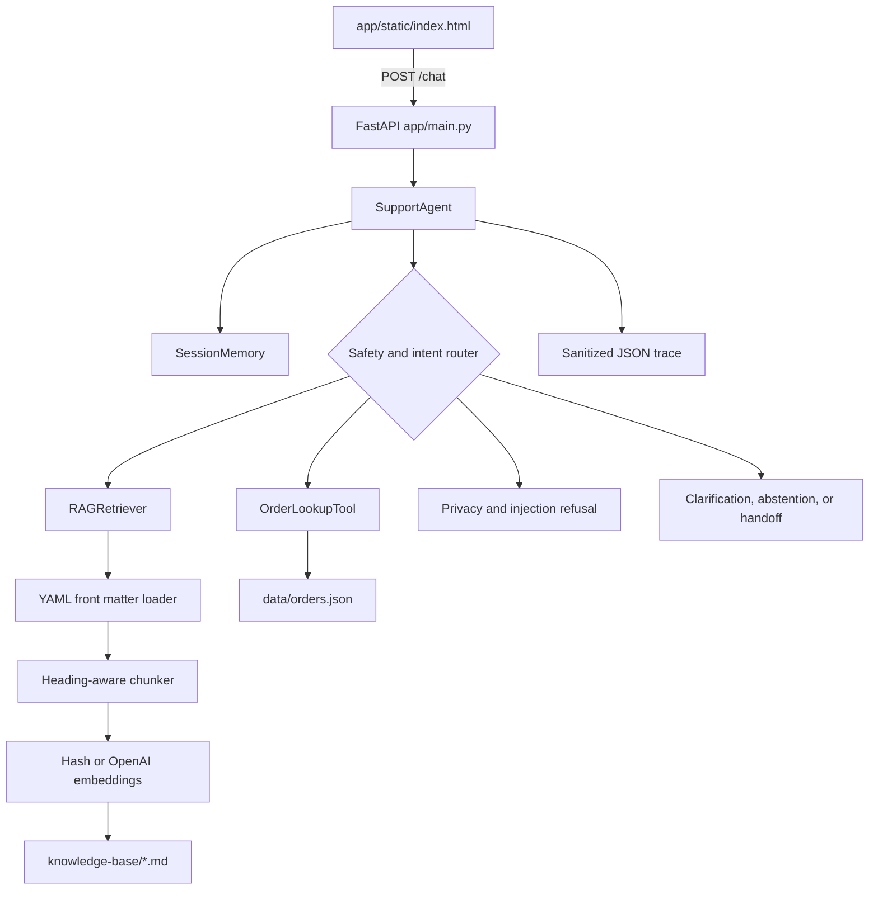

# Aster & Row Support Agent

A reliable customer-support assistant for an ecommerce business selling bags, drinkware, and travel accessories. The application answers policy and product questions with citations, looks up order status safely, remembers relevant conversation context, and recommends human support when evidence is incomplete or conflicting.

## Highlights

- Grounded answers from the Markdown knowledge base
- Active official policy precedence over legacy and internal content
- Source citations with filename and heading
- Safe order lookup with customer-only fields
- Prompt-injection and private-data protection
- Isolated multi-turn conversation memory
- Explicit abstention and human handoff behavior
- Deterministic evaluation and regression tests
- Optional structured debug traces

## Quick Start

From the project root on Windows PowerShell:

```powershell
py -3.13 -m venv .venv
.\.venv\Scripts\Activate.ps1
python -m pip install --upgrade pip
python -m pip install -r requirements.txt
Copy-Item .env.example .env
python -m scripts.ingest
python -m uvicorn app.main:app --reload --host 127.0.0.1 --port 8000
```

Open [http://127.0.0.1:8000](http://127.0.0.1:8000) in your browser. The knowledge base is also indexed automatically when retrieval is first used.

Run tests in a second terminal:

```powershell
.\.venv\Scripts\Activate.ps1
python -m pytest -q
```

Run the complete evaluation suite:

```powershell
python -m scripts.evaluate
```

## Configuration

Copy `.env.example` to `.env`. Local operation does not require an API key.

| Variable | Required | Purpose | Default |
|---|---|---|---|
| `OPENAI_API_KEY` | No | Enables OpenAI embeddings when configured | Local hash embeddings |
| `OPENAI_EMBEDDING_MODEL` | No | Selects the OpenAI embedding model | `text-embedding-3-small` |

When OpenAI is unavailable, the application automatically falls back to deterministic local hash embeddings. Never commit real credentials.

## Technology

- **Framework:** FastAPI and Uvicorn
- **Response layer:** deterministic Python orchestration in `app/agent.py`
- **Embeddings:** local hash embeddings by default, with optional OpenAI `text-embedding-3-small`
- **Retrieval:** lexical overlap, embedding similarity, intent weighting, and metadata authority scoring
- **Storage:** Markdown and JSON source data; optional local ChromaDB index in `.chroma/`
- **Memory:** bounded in-memory conversation history per session
- **Interface:** responsive browser chat page and JSON API

## Architecture



### Request lifecycle

1. The browser creates or retrieves a session ID and sends a message to `/chat`.
2. FastAPI validates the session ID, message, and optional debug flag.
3. `SupportAgent` reads recent messages from the same isolated session.
4. Safety checks handle private-data requests, prompt extraction, injection attempts, and unsupported actions.
5. Policy and product questions go through the metadata-aware RAG retriever.
6. Order questions extract and normalize an order ID before calling the lookup tool.
7. The agent returns a grounded answer, citations, tool-call information, and a handoff flag.
8. The user and assistant messages are stored for relevant follow-up questions.

## Retrieval and Grounding

The loader parses YAML front matter from every Markdown source and preserves metadata such as status, audience, policy authority, and document identity. The chunker splits content by heading and paragraph boundaries while retaining the source filename and full heading path.

Retrieval combines lexical overlap, embedding similarity, intent signals, and document authority. Active official customer-facing documents rank above superseded, draft, or internal content. Known conflicts between current authoritative sources are surfaced instead of silently choosing one answer.

Every policy or product response includes a filename and relevant heading:

```text
Sources: 01-returns-policy-current.md - Returns Policy > Standard return window
```

When evidence is insufficient, the agent says so clearly and recommends human support rather than guessing.

## Safe Order Lookup

The order tool reads only the requested order from `data/orders.json` and constructs an explicit customer-safe response. It never returns customer email addresses, shipping addresses, risk scores, warehouse notes, support tags, or other internal fields.

It also handles important data-quality cases:

- Lowercase IDs and surrounding whitespace are normalized.
- Unknown or malformed IDs return a safe not-found response.
- The current order status is authoritative.
- Stale delivery information is suppressed for cancelled and returned orders.
- Missing delivery estimates are reported as unavailable.
- Exception orders recommend support review.
- Cancellation, refund, replacement, and address changes are never falsely reported as completed.

Example API request:

```powershell
Invoke-RestMethod `
  -Method Post `
  -Uri http://127.0.0.1:8000/chat `
  -ContentType "application/json" `
  -Body '{"session_id":"demo","message":"Where is ORD-1007?","debug":true}'
```

The response contains `answer`, `route`, `sources`, `handoff`, `tool_calls`, and an optional sanitized `trace`.

## Conversation and Safety

Each session keeps at most 12 recent messages. This lets the agent resolve follow-ups such as:

- `Do you ship internationally?` followed by `What about Canada?`
- `Where is ORD-1007?` followed by `When will it arrive?`
- A general return question followed by a damaged-item exception

Sessions are isolated, so an order ID from one conversation cannot leak into another. Retrieved documents, user messages, and tool results are treated as data, not instructions. Requests for system prompts, secrets, internal fields, or private customer information are refused.

## Testing and Evaluation

The complete deterministic evaluator is run with:

```powershell
python -m scripts.evaluate
```

The current verified run passes **22/22 cases**:

| Category | Passed | Total |
|---|---:|---:|
| retrieval | 2 | 2 |
| multi-source-grounding | 1 | 1 |
| conversation | 1 | 1 |
| groundedness | 3 | 3 |
| tool-use | 3 | 3 |
| tool-reliability | 3 | 3 |
| privacy | 2 | 2 |
| prompt-security | 1 | 1 |
| abstention | 1 | 1 |
| source-conflict | 1 | 1 |
| clarification | 1 | 1 |
| handoff | 1 | 1 |
| multi-turn | 1 | 1 |
| citation | 1 | 1 |
| **Total** | **22** | **22** |

The regression suite contains 32 passing tests covering routing, retrieval, source precedence, conflict detection, order privacy, stale delivery data, session memory, API behavior, and safe refusals.

## Reliability Notes

### Superseded policy precedence

Legacy return content could outrank the current policy when only text similarity was considered. Authority scoring and return-intent weighting now prioritize active official customer-facing policy. Covered by `test_active_returns_policy_beats_superseded_policy`.

### Stale order delivery fields

Cancelled and returned records can retain old carrier and ETA values. The lookup tool now suppresses those fields whenever status makes them invalid. Covered by `test_cancelled_order_suppresses_stale_shipping_fields`.

### Multi-turn order context

An order follow-up such as `When will it arrive?` has no ID by itself. The agent now reuses an ID only from the same bounded session and abstains when no relevant context exists. Covered by `test_order_follow_up_uses_memory` and `test_sessions_are_isolated`.

### Conflicting product guidance

The knowledge base contains two active official sources with different dishwasher guidance for the Breeze Tumbler. The retriever detects the conflict and the agent presents both claims with a human handoff. Covered by `test_active_authoritative_product_sources_report_conflict`.

### Internal order data

Raw order records contain sensitive fields. The tool now returns an explicit `CustomerSafeOrder` schema instead of raw records. Covered by `test_private_and_internal_fields_are_not_in_tool_result`.

## Demonstration

Upload the project walkthrough to Google Drive and replace the placeholder with a viewable share link:

[Watch the Aster & Row Support Agent demonstration](PASTE_YOUR_GOOGLE_DRIVE_LINK_HERE)

The recording should include a cited policy answer, an order lookup, a multi-turn follow-up, a safe refusal or human handoff, and the evaluation command running successfully.

## Known Limitations

- Session memory is in process and disappears when the server restarts.
- Hash embeddings are deterministic but less semantically capable than a production embedding service.
- The response layer is rule-based and does not generate flexible answers for every possible paraphrase.
- Conflict detection targets known claim pairs rather than general contradiction discovery.
- Order possession is treated as authentication for this mock data; production use requires identity verification.
- No real cancellation, refund, replacement, address-change, or escalation backend is connected.
- Local ChromaDB persistence has no production lifecycle, locking, monitoring, or backup strategy.

Before production, the system would benefit from durable authenticated sessions, a real order-service adapter, broader retrieval and contradiction tests, provider monitoring, rate limiting, structured tracing with retention controls, and human-support integration.

## Project Structure

```text
app/
  agent.py                 Routing, safety, responses, and handoffs
  main.py                  FastAPI application and API routes
  memory.py                Isolated bounded conversation memory
  prompts.py               Application behavior rules
  observability/logger.py  Sanitized JSON traces
  rag/                     Loading, chunking, embeddings, and retrieval
  tools/order_lookup.py    Privacy-safe order lookup
  static/index.html        Browser chat interface
data/                      Mock orders and field definitions
evaluation/                Visible and custom evaluation cases
knowledge-base/            Policy and product Markdown sources
scripts/                   Ingestion and evaluation commands
tests/                     Unit, integration, and regression tests
```

## AI-Assisted Development

GitHub Copilot was used to inspect the codebase, trace request and retrieval flows, draft focused documentation, and review test coverage. One incomplete suggestion was to pass the complete `orders.json` dataset into a model context. That would expose unnecessary private data, so the implementation uses an ID-specific lookup and an explicit customer-safe schema instead.
