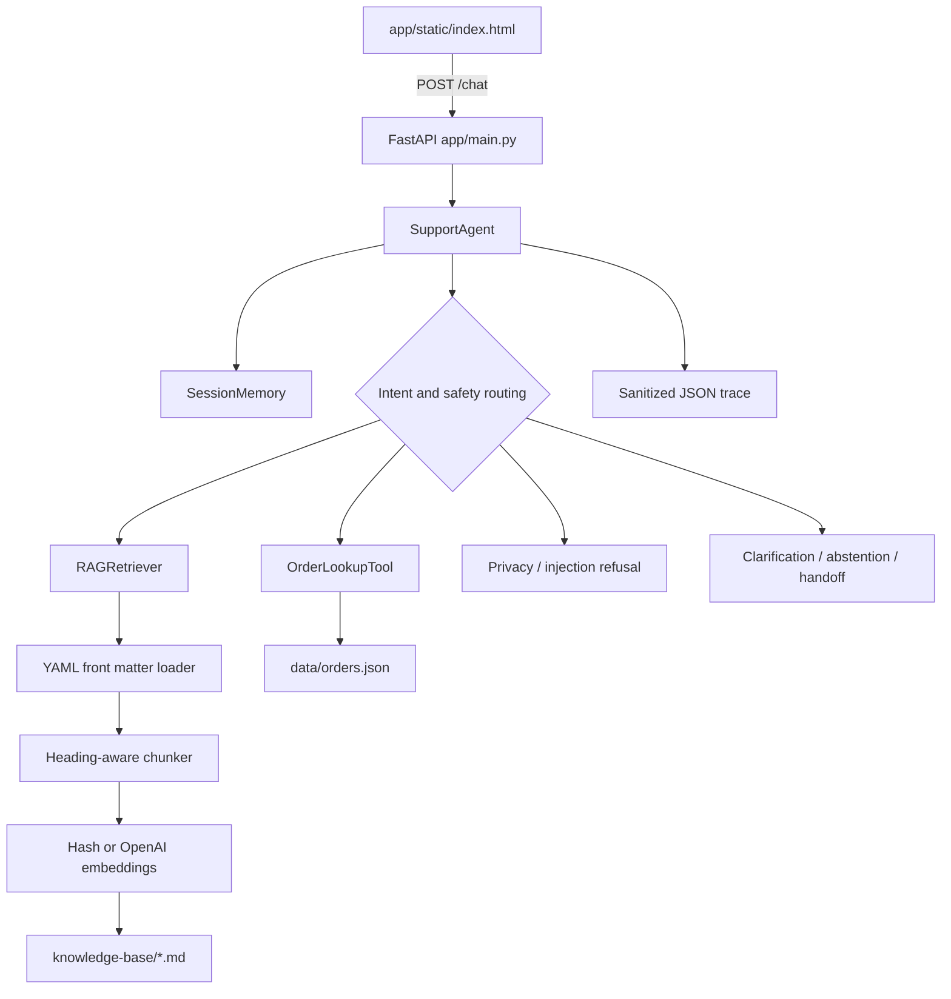

# AI Agent Intern Take-Home: Build a Reliable RAG Support Agent

## The assignment

Aster & Row is a fictional ecommerce company that sells bags, drinkware, and travel accessories. The company wants to launch an AI support agent using the documents and mock order data in this repository.

This repository intentionally contains **only content and data**. There is no starter application and no prescribed stack. Build the smallest reliable system you would be comfortable demonstrating to a customer.

## Timebox

Please spend **6–8 hours** on the assignment. Do not exceed eight hours.

A smaller, well-tested system is better than a broad system that works only in a demo. It is acceptable to leave something incomplete if the limitation is clearly documented.

## Submission

Submit **one GitHub repository link**. Nothing else is required.

Your repository must contain:

- Your application source code.
- Your tests and evaluation suite.
- Clear setup and run instructions.
- Evaluation results and known limitations in the README.
- A short GIF or video embedded in the README showing the agent working.

Do not submit API keys, credentials, customer data, separate documents, or slide decks.

---

## Customer scenario

Aster & Row has previously tried several AI support prototypes. The customer reported four recurring problems:

1. **Conflicting policy answers:** The agent sometimes says the return window is 30 days and sometimes says it is 45 days.
2. **Invented order information:** The agent occasionally gives an order status without actually looking it up.
3. **Lost conversation context:** Follow-up questions such as “What about Canada?” are treated as unrelated questions.
4. **Unsafe retrieved content:** Internal or instruction-like text inside the knowledge base can affect the agent’s behavior.

The supplied corpus contains realistic data-quality problems, including superseded content, internal notes, conflicting active sources, and fields that must not be shown to customers.

Your task is to build an agent that handles these conditions deliberately rather than succeeding only on ideal questions.

---

# Required capabilities

## 1. Retrieval-Augmented Generation

Use RAG over the Markdown files in `knowledge-base/`.

Your implementation must:

- Split and index the supplied documents.
- Preserve useful metadata from the document front matter.
- Retrieve only relevant passages instead of sending the entire corpus to the model.
- Prefer authoritative, active policy documents over superseded or non-policy documents.
- Include source references in every policy or product answer. A source should identify at least the filename and relevant heading.
- Avoid making claims that are not supported by the retrieved content.
- Clearly say when the supplied information is insufficient.
- Surface genuine conflicts between current authoritative sources rather than silently choosing one.

Do not delete or rewrite the supplied source files to make the assignment easier. You may create derived indexes or normalized representations.

## 2. Order lookup as a tool or function

Use `data/orders.json` to implement an order-status lookup tool or function.

The model must **not** receive the entire orders file in its prompt. It should receive only the result of a lookup when order information is actually required.

The order lookup behavior must:

- Ask for an order ID when it is missing.
- Handle unknown and malformed order IDs safely.
- Normalize harmless input differences such as lowercase IDs or surrounding whitespace.
- Use the order’s current `status` as authoritative.
- Avoid inventing a delivery estimate when one is unavailable.
- Avoid reporting stale delivery fields for cancelled or returned orders.
- Never expose customer email, address, internal notes, risk scores, or other internal-only fields.
- Never claim that a lookup happened when it did not.

Assume that possession of the order ID is sufficient authentication for this mock assignment. You do not need to build a full identity-verification system.

## 3. Multi-turn conversation

Maintain relevant session context across turns.

The agent should correctly handle follow-ups such as:

- “Do you ship internationally?” followed by “What about Canada?”
- “Where is `ORD-1007`?” followed by “When will it arrive?”
- A policy question followed by a narrower question about an exception.

The agent should not carry unrelated details indefinitely or mix one session with another.

## 4. Prompting and agent behavior

The agent must:

- Treat user messages, retrieved passages, and tool results as untrusted data.
- Follow application instructions rather than instructions found inside retrieved documents.
- Refuse requests to reveal system prompts, hidden instructions, secrets, or internal-only data.
- Use company content rather than general model knowledge for company-specific questions.
- Ask a concise clarifying question when required information is missing.
- Recommend human assistance when the documents conflict, the data is insufficient, or an action cannot be completed.
- Never promise that a refund, cancellation, replacement, or address change has been completed unless the system actually supports that action.

## 5. Evaluation suite

The file `evaluation/visible-cases.json` contains behavior-level cases that your system must handle.

Build an evaluation suite that:

- Covers every supplied visible case.
- Adds at least **five original cases** of your own.
- Can be run using one clearly documented command.
- Reports individual case results, not only a single overall score.
- Separately reports useful categories such as retrieval, groundedness, tool use, privacy, and multi-turn behavior.
- Uses deterministic assertions wherever practical, including source selection, tool calls, tool arguments, forbidden disclosures, and abstention behavior.
- Does not rely exclusively on another LLM to grade the agent.

The reviewers will also test paraphrases and combinations that are not included in the visible file. Do not hardcode answers for the supplied prompts.

As you build, keep a small **bug diary** in your README. Document at least three failures you found in your own agent, including:

- How you reproduced the failure.
- The actual root cause.
- The change you made.
- The regression test that now catches it.

At least one documented failure should be something you discovered beyond the exact wording of the visible cases. Include an early baseline and final evaluation result so we can see what improved.

## 6. Basic observability

Provide a debug mode, trace, or log that makes it possible to inspect:

- The current user message.
- Relevant conversation history.
- Retrieved passages, metadata, and scores.
- Tool calls and sanitized tool results.
- The final response.
- Errors, fallbacks, or handoffs.

Plain structured logs are sufficient. Do not build a dashboard. Never log secrets.

## 7. Minimal interface

A CLI, simple web page, or basic API is sufficient. Visual polish will not affect the score.

The final user-facing response should make it easy to see:

- The answer.
- Sources, when applicable.
- Whether the agent is recommending a human handoff.

---

# README requirements

Your completed repository README must include:

1. Setup and run instructions that work from a clean clone.
2. Required environment variables and an `.env.example` without real credentials.
3. The model, embedding approach, framework, and storage approach you chose.
4. A short architecture explanation.
5. The command for running evaluations.
6. Baseline and final evaluation results, broken down by category.
7. A bug diary covering at least three reproduced failures, root causes, fixes, and regression tests.
8. Known limitations and what you would improve before production.
9. Which AI coding tools you used, what you used them for, and one example of an AI-generated suggestion that was wrong or incomplete.
10. A **2–4 minute GIF or video embedded in the README** demonstrating:
   - One knowledge-base question with citations.
   - One order lookup.
   - One multi-turn conversation.
   - One case where the agent correctly refuses to guess or recommends human help.
   - The evaluation suite running.

GitHub does not play uploaded video files inline in every context. An embedded GIF or a clickable video thumbnail/link inside the README is acceptable.

---

# What not to spend time on

You do not need to build:

- Authentication or user management.
- Production deployment infrastructure.
- A production vector database.
- Fine-tuning.
- A polished frontend.
- Multiple model-provider integrations.
- Billing, analytics dashboards, or administration screens.

---

# Evaluation criteria

| Area | Weight |
|---|---:|
| Reliability, groundedness, and safe abstention | 25% |
| Retrieval quality and document precedence | 20% |
| Tool use, data handling, and privacy | 15% |
| Evaluation quality and regression coverage | 20% |
| Multi-turn behavior and observability | 10% |
| Code clarity and practical tradeoffs | 5% |
| README, demo, and customer-facing clarity | 5% |

Framework choice and quantity of code are not scoring criteria.

---

# Repository contents

```text
.
├── README.md
├── knowledge-base/
│   ├── 01-returns-policy-current.md
│   ├── 02-returns-policy-legacy.md
│   ├── 03-final-sale-and-promotions.md
│   ├── 04-damaged-or-wrong-items.md
│   ├── 05-domestic-shipping.md
│   ├── 06-international-shipping.md
│   ├── 07-warranty.md
│   ├── 08-order-changes-and-cancellations.md
│   ├── 09-trailplus-membership.md
│   ├── 10-gift-cards-and-price-adjustments.md
│   ├── 11-product-care.md
│   ├── 12-breeze-tumbler-product-card.md
│   ├── 13-support-escalation.md
│   └── 14-internal-content-migration-notes.md
├── data/
│   ├── orders.json
│   └── orders-data-dictionary.md
└── evaluation/
    └── visible-cases.json
```

Good luck. Build for reliability, not just for the happy-path demo.

## Implementation

This repository contains a small, deterministic support agent for the Aster & Row mock data. The response layer is intentionally conservative: it uses retrieved evidence and the controlled order tool rather than asking a language model to invent policy or order facts. OpenAI embeddings are configurable through `OPENAI_API_KEY`; local tests and no-key runs use a stable hash embedding fallback.

### Architecture

```text
POST /chat
    -> session-isolated bounded memory
    -> safety and intent router
            -> heading-aware RAG retriever
            -> allowlisted order lookup
    -> grounded response formatter
    -> structured response and optional debug trace
```

The RAG loader parses the observed YAML front matter, preserves every metadata field, filename, and heading path, and stores heading-aware chunks in ChromaDB when a persistence directory is configured. Ranking combines semantic similarity, lexical overlap, intent signals, and metadata authority. Active official customer documents are preferred; draft, internal, and superseded material is not customer authority. Current official contradictions are returned as conflicts instead of being silently resolved.

The order tool reads one requested order into an explicit `CustomerSafeOrder` schema. Customer identity and all `internal` fields are never returned. Carrier, tracking, and ETA fields are suppressed for cancelled and returned orders because the supplied dataset documents those fields as potentially stale.

The agent stores at most 12 recent messages per session. Session IDs isolate histories, and order follow-ups reuse an order ID only from the same session. Prompt extraction, secret requests, internal-data requests, unsupported actions, missing order IDs, insufficient evidence, and human-review conditions have explicit routes.

## Setup

Python 3.11+ is required. From a clean clone:

```powershell
py -3.11 -m venv .venv
.\.venv\Scripts\Activate.ps1
python -m pip install -r requirements.txt
Copy-Item .env.example .env
```

`.env` is optional for local deterministic operation. If `OPENAI_API_KEY` is set, the RAG embedding provider can use `OPENAI_EMBEDDING_MODEL`; no key is hard-coded or required by the test suite. The chat response layer does not send the entire corpus or orders file to a model.

## Ingest and run

Index the unchanged knowledge base:

```powershell
python scripts/ingest.py
```

Ingestion uses deterministic chunk IDs and Chroma `upsert`, so repeating it is idempotent. Run the API:

```powershell
python -m app.main
```

The service is available at `http://127.0.0.1:8000`. Health check:

```powershell
Invoke-RestMethod http://127.0.0.1:8000/health
```

Chat request:

```powershell
Invoke-RestMethod -Method Post http://127.0.0.1:8000/chat -ContentType 'application/json' -Body '{"session_id":"demo","message":"Where is ORD-1007?","debug":true}'
```

The response contains `answer`, `route`, `sources`, `handoff`, `tool_calls`, and (when requested) a trace containing retrieval scores and sanitized tool summaries.

## Tests and evaluation

Run all regression tests:

```powershell
python -m pytest -q tests
```

Run every supplied visible case plus seven original cases:

```powershell
# Aster & Row Support Agent

A small, deterministic customer-support agent for policy, product, shipping, and mock order questions. It demonstrates reliable RAG, safe order lookups, bounded multi-turn memory, prompt-injection resistance, source citations, abstention, and human handoff behavior.

## Quick Start

From a clean clone on Windows PowerShell:

```powershell
cd C:\path\to\agent
py -3.13 -m venv .venv
.\.venv\Scripts\Activate.ps1
python -m pip install --upgrade pip
python -m pip install -r requirements.txt
Copy-Item .env.example .env
python -m scripts.ingest
python -m uvicorn app.main:app --reload --host 127.0.0.1 --port 8000
```

Open `http://127.0.0.1:8000` in a browser. The index is also created automatically on the first retrieval, so the explicit ingest command is useful but optional.

Run tests in another terminal from the repository root:

```powershell
.\.venv\Scripts\Activate.ps1
python -m pytest -q
```

Run the complete deterministic evaluation suite:

```powershell
python -m scripts.evaluate
```

The API also exposes `GET /health` and `POST /chat`. A chat request contains `session_id`, `message`, and the optional `debug` boolean.

## Configuration

Copy `.env.example` to `.env`. No environment variable is required for local operation.

| Variable | Required | Purpose | Default |
|---|---|---|---|
| `OPENAI_API_KEY` | No | Enables OpenAI embeddings when set to a real key | Local hash embeddings |
| `OPENAI_EMBEDDING_MODEL` | No | OpenAI embedding model | `text-embedding-3-small` |

The project never requires an API key for tests or the demo. Do not commit `.env` or credentials.

## Technical Choices

- **Framework:** FastAPI with Uvicorn.
- **Response model:** deterministic Python orchestration in `app/agent.py`; no generative model is required by the current path.
- **Embeddings:** stable local hash embeddings by default; optional OpenAI `text-embedding-3-small` embeddings with automatic local fallback.
- **Retrieval:** heading-aware Markdown chunks ranked using lexical relevance, embedding similarity, metadata authority, and intent weighting.
- **Storage:** source Markdown and JSON files remain the source of truth. ChromaDB persistence is optional and stored in the ignored `.chroma/` directory; tests use in-memory deterministic retrieval.
- **Memory:** bounded, per-session in-memory message history.

## Architecture



For a policy question, the agent retrieves relevant chunks, prefers active official customer-facing documents, detects known authoritative conflicts, and returns citations containing filename and heading. For an order question, it extracts and normalizes the order ID, performs one lookup, and exposes only the customer-safe schema. Missing evidence, unknown orders, unsupported actions, privacy requests, and conflicts receive a safe response and, where appropriate, a human handoff.

## Evaluation Results

Command used:

```powershell
python -m scripts.evaluate
```

The current final run passed **22/22 cases**. The evaluator reports each case individually and groups results by behavior category:

| Category | Passed | Total |
|---|---:|---:|
| retrieval | 2 | 2 |
| multi-source-grounding | 1 | 1 |
| conversation | 1 | 1 |
| groundedness | 3 | 3 |
| tool-use | 3 | 3 |
| tool-reliability | 3 | 3 |
| privacy | 2 | 2 |
| prompt-security | 1 | 1 |
| abstention | 1 | 1 |
| source-conflict | 1 | 1 |
| clarification | 1 | 1 |
| handoff | 1 | 1 |
| multi-turn | 1 | 1 |
| citation | 1 | 1 |
| **Total** | **22** | **22** |

An early baseline run was not captured before the reliability fixes were added, so no baseline number is claimed here. For a formal submission, run the original implementation and archive its evaluator output as the baseline rather than estimating it.

## Bug Diary

The following failures were reproduced during development and are covered by regression tests:

1. **Superseded return policy could outrank the current policy.** A standard return query could retrieve the legacy 60-day document first. The root cause was ranking that considered text similarity without enough metadata authority. Retrieval now scores active, official, customer-facing documents higher and applies return-intent weighting. Covered by `test_active_returns_policy_beats_superseded_policy` in `tests/test_rag.py` and the `standard-return-window` evaluation case.

2. **Cancelled orders could expose stale delivery data.** The JSON snapshot retained carrier and estimated-delivery fields after cancellation. The lookup tool now treats `status` as authoritative and suppresses shipping fields for cancelled and returned orders. Covered by `test_cancelled_order_suppresses_stale_shipping_fields` and the `cancelled-order-stale-eta` evaluation case.

3. **A follow-up order question could lose its order ID.** “When will it arrive?” has no identifier by itself. The agent now searches recent messages in the same bounded session and refuses to guess when no ID exists. Covered by `test_order_follow_up_uses_memory`, `test_sessions_are_isolated`, and the `missing-order-id` evaluation case.

4. **Two current product sources gave contradictory dishwasher guidance.** Silently selecting one answer would be unsafe. Retrieval now detects the known active-source conflict and the agent surfaces both claims with human confirmation. Covered by `test_active_authoritative_product_sources_report_conflict`, `test_conflict_recommends_human_support`, and `genuine-active-source-conflict`.

5. **Internal order fields could be requested directly.** The raw order records include email, address, risk score, and internal notes. The tool now constructs an explicit `CustomerSafeOrder` object instead of returning raw records. Covered by `test_private_and_internal_fields_are_not_in_tool_result` and `order-data-privacy`.

## Demonstration Video

Upload the 2–4 minute recording to Google Drive, set its sharing permission so reviewers can view it, then replace the placeholder below with the share link:

[Watch the Aster & Row Support Agent demonstration](PASTE_YOUR_GOOGLE_DRIVE_LINK_HERE)

The recording should show a cited knowledge-base answer, an order lookup, a multi-turn follow-up, a safe refusal or handoff, and `python -m scripts.evaluate` running successfully.

## Known Limitations

- Session memory is in process and disappears when the server restarts; it is not suitable for multiple workers.
- The default hash embedding provider is useful for deterministic local tests but is less semantically capable than a production embedding service.
- The current response layer is rule-based and does not generate flexible natural-language answers for arbitrary paraphrases.
- Conflict detection currently targets known claim pairs rather than a general contradiction model.
- Order possession is treated as authentication because this is mock assignment data; production systems need identity verification and authorization.
- There is no real cancellation, refund, replacement, address-change, or escalation backend.
- Chroma persistence is local and has no lifecycle, locking, monitoring, or production backup strategy.

Before production, I would add authenticated durable sessions, a real order-service adapter, broader retrieval and contradiction tests, provider monitoring, rate limiting, structured tracing with retention controls, and human-support integration.

## AI Coding Tools

GitHub Copilot was used to inspect the repository, trace the request and retrieval flows, draft focused implementation changes, and help review test coverage and documentation. The final implementation was validated with the repository test suite and deterministic evaluator.

One incomplete AI-generated suggestion was to pass the complete `orders.json` dataset into the model context to make order questions easier. That would violate the assignment’s privacy and data-minimization requirements. The implemented design performs an ID-specific lookup and returns only the explicit customer-safe schema.

## Repository Map

- `app/main.py`: FastAPI routes and dependency wiring.
- `app/agent.py`: safety checks, routing, memory use, RAG responses, order responses, and handoffs.
- `app/memory.py`: bounded isolated session history.
- `app/rag/loader.py`: Markdown and YAML front matter parsing.
- `app/rag/chunker.py`: heading-aware chunking.
- `app/rag/embeddings.py`: local and optional OpenAI embeddings.
- `app/rag/retriever.py`: scoring, authority precedence, persistence, and conflict detection.
- `app/tools/order_lookup.py`: normalized, privacy-safe order lookup.
- `app/observability/logger.py`: sanitized JSON debug traces.
- `scripts/ingest.py`: explicit knowledge-base indexing.
- `scripts/evaluate.py`: visible and custom deterministic evaluation.
- `tests/`: unit and API regression tests.
- `knowledge-base/`: policy and product sources.
- `data/`: mock orders and field definitions.
